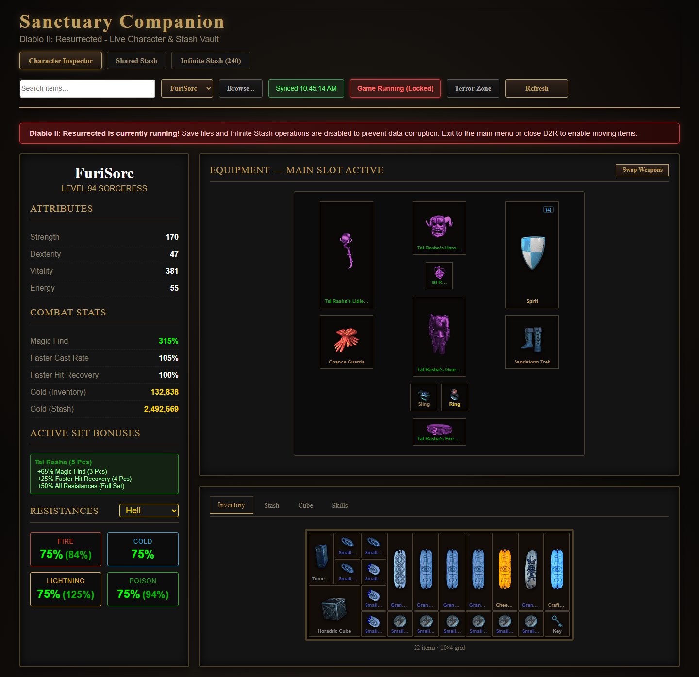
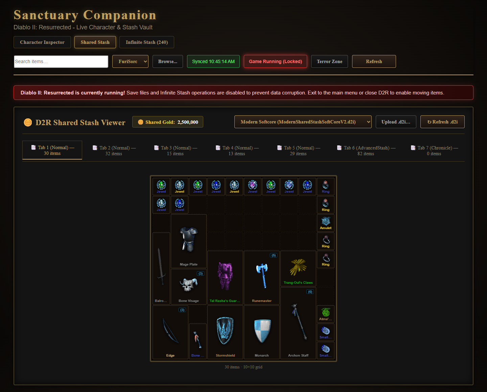
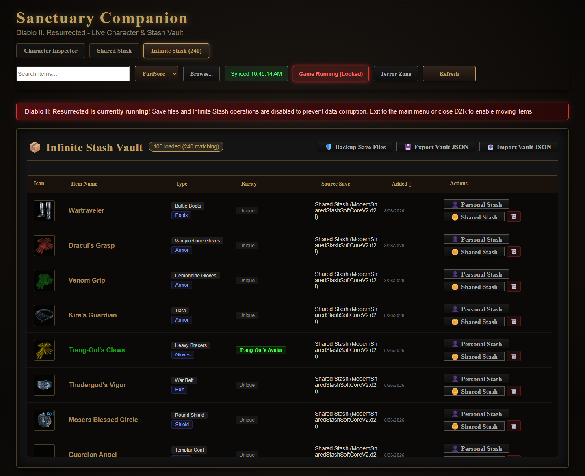

# Sanctuary Companion

Sanctuary Companion is a local companion app for **Diablo II: Resurrected**. It gives you a searchable view of your characters and stashes, makes item details easier to inspect, and provides an Infinite Stash vault for organizing items across saves.

It runs locally in your browser and works with the save files already on your machine. It is designed for single-player / offline save management and does not connect to Battle.net.

## What it does

- Inspect character stats, equipment, inventory, stash, cube, skills, and resistance breakdowns.
- Browse and search D2R shared stash pages.
- Move items between character/shared stash saves and the Infinite Stash vault, with safety checks and backups around mutations.
- Search across characters, shared stash, and the Infinite Stash from one global search box.
- View Terror Zone timing information and other companion utilities.
- Keep the Infinite Stash in a local SQLite database instead of mirroring the whole vault in browser storage.

## Screenshots

### Character Inspector



### Shared Stash



### Infinite Stash



> The screenshots were captured from a local save directory. The red **Game Running (Locked)** state is intentional: save-changing actions are disabled while D2R is running to reduce the risk of corruption.

## Quick start

Requirements:

- Windows with Diablo II: Resurrected save files available locally.
- Node.js and npm.
- A sibling checkout of [D2SSharp](https://github.com/ResurrectedTrader/D2SSharp) for the save worker.

Install dependencies and start the local app:

```powershell
npm install
npm run dev
```

Open the local URL printed by Vite, normally `http://127.0.0.1:5173`.

Before moving items, exit D2R to unlock save mutations. On first use, select a character or shared stash file from the controls in the header. You can also use **Browse...** / **Upload .d2i...** to inspect a save file manually.

To enable private local item artwork, run:

```powershell
python scripts/assets/extract-d2r-item-assets.py
```

The artwork cache is intentionally ignored by Git and should not be redistributed.

## Documentation

- [User guide](docs/usage.md) — setup, daily workflows, transfers, backups, and troubleshooting.
- [Architecture](docs/architecture.md) — worker boundary, server routes, SQLite vault, recovery, and testing strategy.

## Validation

```powershell
npm run build
npm run lint
npm test
```

`npm test` includes a production-browser smoke test. If Chrome is not installed locally, run `npx puppeteer browsers install chrome` first (or set `PUPPETEER_EXECUTABLE_PATH`).

If an interrupted dev server or test run leaves local processes behind, run `npm run cleanup:dev` before restarting the app. It only targets this repository's Node processes and port 5173.

The worker integration tests use isolated copies of save fixtures and clean up their temporary directories after each run. See the [architecture notes](docs/architecture.md) for the full validation matrix.

## License

See [LICENSE](LICENSE).
